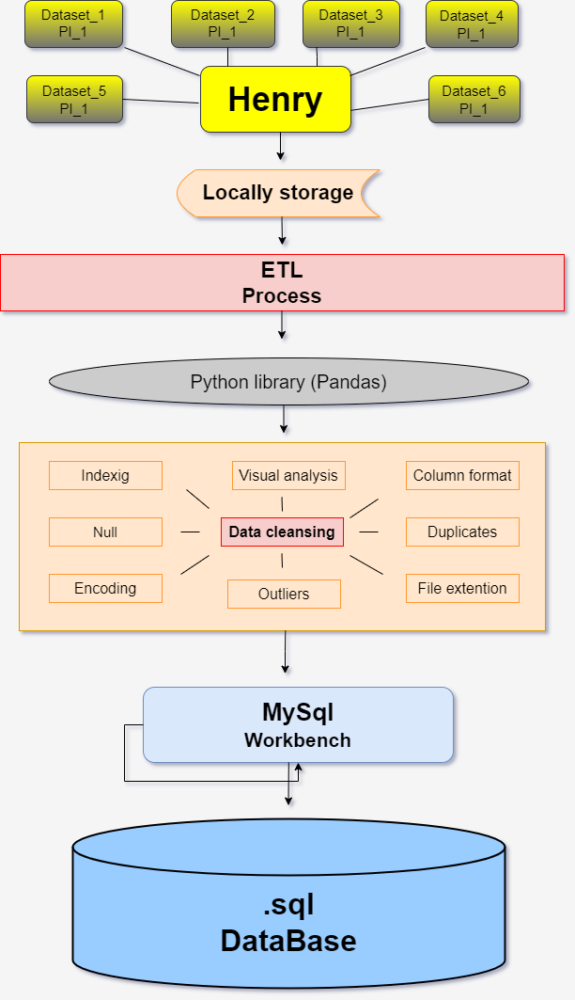
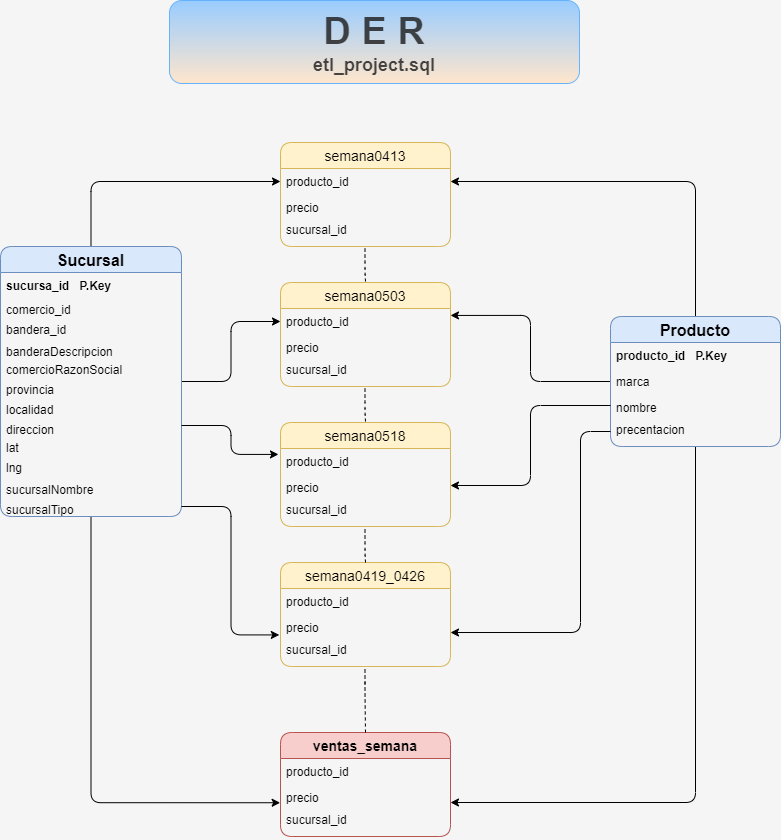

# ETL-milestone
  This project is based on **engineering data** and it is required as fundamental step in **"Henry"** data science academy.

  During the previously mentioned project, I have implemented several data science concepts regarding cleansing and consulting technics I learned during the **Henry's bootcamp**.

  *The target* is to apply the three-phases in a ETL process. The primitive data set were provided for Henry academy in different type of files. (.xlsx, .txt, .parquet, .csv)

  The **ETL** path that I followed was initially download the raw documents into my locall machine, then by using a visualization platform (VSCode) I uploaded the documents for starting the visual analysis and recognition stage, identifying nulls -NaN -outliers -usefull  registers and columns. 

  By using **Python** programming language and some of their libraries (pandas, NumPy) implemented cleansing technics such as drop null values, implementing methods and built-in functions like strip (), slice(), and apply() I transformed the data and set it up until converting it in a .csv file to finally loaded in a database visualization and manipulation program like **MySql** where after checking the new datasets conditions was created the final product (DATABASE) in shape and quality.

## Images related

        

## Built With

- Python (numpy, pandas, openpyxls, fastparqet)
- MySql (Workbench)
- VSCode
- draw.io

## Prerequisites

- Basics knowledge of python and sql pragramming/consulting languages

## Authors

👤 **Leon Yohel Espitia**

- GitHub: [@Leon-Espitia](https://github.com/Leon-Espitia)
- Twitter: [@LenEspitia1](https://twitter.com/LenEspitia1)
- LinkedIn: [leon-espitia](https://www.linkedin.com/in/leon-espitia/)

## Show your support

Give a ⭐️ if you like this project!

